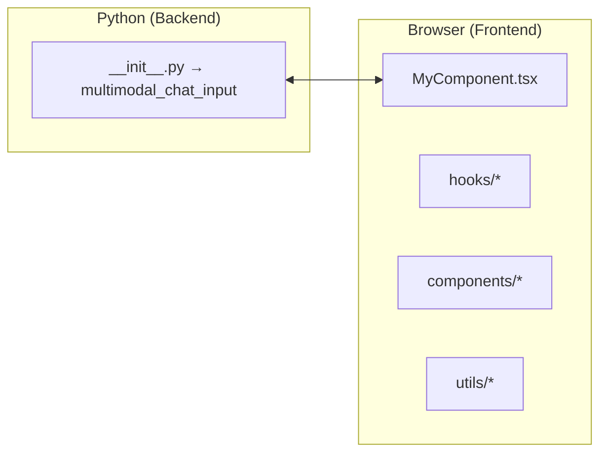

[English](API_REFERENCE.md) | [日本語](API_REFERENCE-ja_JP.md)

# st_chat_input_multimodal — APIリファレンス

> このリポジトリに含まれる公開 API、React コンポーネント、hooks、utilities のリファレンスです。  
> 最終更新日: 2026-03-29

---

## 1  概要

`st_chat_input_multimodal` は、以下をサポートする **Streamlit 向けマルチモーダル chat-input** を提供します。

* **テキスト入力**: 文字数カウンタ付きの自動拡張テキストエリア
* **画像アップロード**: ボタン、ドラッグ&ドロップ、クリップボード貼り付け（Ctrl + V）
* **音声入力**: ブラウザの Web Speech API またはサーバー側 OpenAI Whisper 文字起こし

内部構成は、薄い **Python ラッパー** と **React / TypeScript フロントエンド** の組み合わせです。通常の利用者は `multimodal_chat_input` だけを使えば十分で、TypeScript ソースはコントリビューター向けです。



---

## 2  インストール

```bash
pip install st-chat-input-multimodal
# またはソースから
pip install -e .
```

---

## 3  クイックスタート（Python）

```python
import streamlit as st
from st_chat_input_multimodal import multimodal_chat_input

st.title("💬 Multimodal Chat Input Demo")

result = multimodal_chat_input(
    placeholder="Say hi…",
    enable_voice_input=True,
    voice_recognition_method="web_speech",  # or "openai_whisper"
    voice_language="en-US",
    accepted_file_types=["png", "jpg", "jpeg"],
    max_files=3,
)

if result:
    st.write(result)
```

この関数は、**送信時にだけ** 辞書を返し、それ以外は `None` を返します。
`openai_whisper` を使う場合は、Python 実行環境に `OPENAI_API_KEY` を設定する形を推奨します。`openai_api_key` を明示的に渡しても、その値は Python 側にのみ保持され、フロントエンドには送られません。

### 3.1  関数シグネチャ

```python
multimodal_chat_input(
    placeholder: str = "Type your message here...",
    max_chars: int | None = None,
    disabled: bool = False,
    accepted_file_types: list[str] | None = None,
    max_file_size_mb: int = 10,
    max_files: int = 5,
    enable_voice_input: bool = False,
    voice_recognition_method: Literal["web_speech", "openai_whisper"] = "web_speech",
    openai_api_key: str | None = None,
    voice_language: str = "ja-JP",
    max_recording_time: int = 60,
    key: str | None = None,
) -> dict | None
```

| 引数 | 型 | デフォルト | 説明 |
|------|----|-----------|------|
| `placeholder` | `str` | `"Type your message here..."` | プレースホルダテキスト。 |
| `max_chars` | `int \| None` | `None` | 最大文字数。`None` は無制限。 |
| `disabled` | `bool` | `False` | コンポーネント全体を無効化するか。 |
| `accepted_file_types` | `list[str] \| None` | 画像系デフォルト | 許可する拡張子一覧。ドット不要。 |
| `max_file_size_mb` | `int` | `10` | 1ファイルあたりの最大サイズ。 |
| `max_files` | `int` | `5` | 1回の入力で保持できる最大ファイル数。 |
| `enable_voice_input` | `bool` | `False` | マイクボタンを表示するか。 |
| `voice_recognition_method` | `"web_speech" \| "openai_whisper"` | `"web_speech"` | 音声認識の方式。 |
| `openai_api_key` | `str \| None` | `None` | `openai_whisper` 用。Python 側でのみ使われ、ブラウザには送られません。未指定時は `OPENAI_API_KEY` を参照します。 |
| `voice_language` | `str` | `"ja-JP"` | 認識言語の BCP-47 タグ。 |
| `max_recording_time` | `int` | `60` | 録音の上限秒数。 |
| `key` | `str \| None` | `None` | Streamlit コンポーネントの一意キー。 |

#### 3.1.1  バリデーションと実行時ルール

- `max_chars` は `None` または正の整数である必要があります。
- `max_file_size_mb` は正の整数である必要があります。
- `max_files` は正の整数である必要があります。
- `max_recording_time` は `1` から `300` の範囲である必要があります。
- `voice_recognition_method` は `"web_speech"` または `"openai_whisper"` のみ指定できます。
- アップロードファイルは拡張子、サイズ、マジックバイトで検証されます。
- 表示時のファイル名はサニタイズされます。
- 音声文字起こしの実行時失敗は、安全なインラインメッセージに変換されます。

#### 3.2  返却値

```python
{
    "text": str,                     # テキスト入力。音声文字起こし結果を含む
    "files": [                       # アップロードファイル
        {
            "name": str,
            "type": str,             # MIME type
            "size": int,             # bytes
            "data": str              # base64 エンコード済みデータ
        }
    ],
    "audio_metadata": {              # 音声入力メタデータ
        "used_voice_input": bool,
        "transcription_method": str, # "web_speech" or "openai_whisper"
        "recording_duration": float, # seconds
        "confidence": float | None,
        "language": str
    } | None
}
```

---

## 4  公開 React 要素（コントリビューター向け）

> すべてのソースは `st_chat_input_multimodal/frontend/src` 配下にあります。

### 4.1  コンポーネント

| コンポーネント | 配置 | 役割 |
|---------------|------|------|
| `MultimodalChatInput` | `MyComponent.tsx` | Streamlit 側に公開されるメインウィジェット。 |
| `ErrorMessage` | `components/ErrorMessage.tsx` | コンポーネント内のエラー・警告メッセージを表示。 |
| `FilePreview` | `components/FilePreview.tsx` | 選択済み画像の一覧、サイズ、削除ボタンを表示。 |
| `FileUploadButton` | `components/FileUploadButton.tsx` | ファイル選択ダイアログを開く `+` ボタン。 |
| `TextInput` | `components/TextInput.tsx` | 自動拡張テキストエリアと文字数表示、貼り付け処理を担当。 |
| `VoiceButton` | `components/VoiceButton.tsx` | 録音開始・停止を切り替えるマイクボタン。 |

### 4.2  カスタム Hook

| Hook | 配置 | 役割 |
|------|------|------|
| `useFileUpload` | `hooks/useFileUpload.ts` | ドラッグ&ドロップ、貼り付け、ファイル検証、base64 変換を担当。 |
| `useVoiceRecording` | `hooks/useVoiceRecording.ts` | マイク制御、録音タイマー、Web Speech / サーバー側 Whisper 連携、クリーンアップを担当。 |
| `useStyles` | `hooks/useStyles.ts` | 状態と Streamlit theme からスタイルオブジェクトを生成。 |

### 4.3  ユーティリティ

| ファイル | 役割 |
|---------|------|
| `constants.ts` | レイアウト、タイミング、UI 設定値の共通定数。 |
| `utils/errorUtils.ts` | エラー状態生成と本番向けログ制御。 |
| `utils/fileUtils.ts` | ファイル検証、マジックバイト判定、ファイル名サニタイズ、`fileToBase64`、`processFiles()`。 |
| `utils/audioUtils.ts` | 録音時間フォーマット、Web Speech 補助、Python 側文字起こしリクエスト生成。 |

### 4.4  共有型

型定義は `types/index.ts` にまとまっています。

* `FileData`
* `AudioMetadata`
* `ComponentArgs`
* `ComponentResult`

---

## 5  使用例

### 5.1  シンプルなチャットアプリ

```python
import streamlit as st
import base64
from st_chat_input_multimodal import multimodal_chat_input

st.header("Simple Chat")

if "history" not in st.session_state:
    st.session_state.history = []

incoming = multimodal_chat_input(enable_voice_input=True, key="chat")

if incoming:
    st.session_state.history.append(incoming)

for msg in st.session_state.history:
    with st.chat_message("user"):
        st.write(msg["text"])
        for f in msg["files"]:
            base64_data = f["data"].split(",")[1] if "," in f["data"] else f["data"]
            st.image(base64.b64decode(base64_data), caption=f["name"], width=150)
```

### 5.2  音声入力を無効化し、画像を制限する例

```python
multimodal_chat_input(
    enable_voice_input=False,
    accepted_file_types=["png"],
    max_file_size_mb=5,
    max_files=3,
)
```

---

## 6  開発とビルド

フロントエンドは **Vite + React 18 + TypeScript** です。

```bash
# st_chat_input_multimodal/frontend 配下で実行
npm ci
npm start        # http://localhost:3000 で開発サーバー起動
npm run build    # build/ に本番用バンドルを出力
```

Python 側ラッパーは、`_RELEASE = True` のとき `frontend/build` を読み込みます。開発時は `_RELEASE = False` にして dev server を参照します。

---

## 7  ライセンス

このプロジェクトは **MIT License** のもとで提供されています。詳細は `LICENSE` を参照してください。
