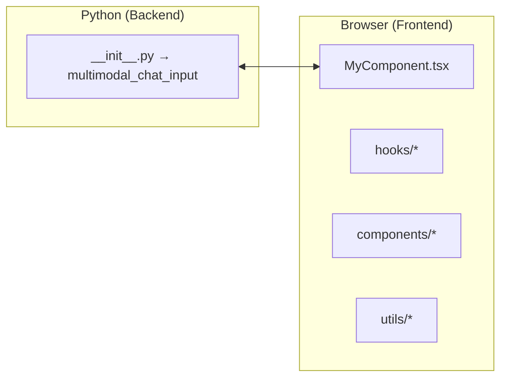

[English](API_REFERENCE.md) | [日本語](API_REFERENCE-ja_JP.md)

# st_chat_input_multimodal — API Reference

> Comprehensive documentation for all public APIs, React components, hooks, and utilities that ship with this repository.  
> Last updated: 2026-03-29

---

## 1  Overview

`st_chat_input_multimodal` provides a **multimodal chat-input field** for Streamlit apps that supports:

* **Text** — auto-expanding textarea with character counter
* **Image upload** — via button, drag-&-drop, *or* clipboard paste (Ctrl + V)
* **Voice input** — using the browser Web-Speech API or server-side OpenAI Whisper transcription

Internally, the project consists of a thin **Python wrapper** around a **React / TypeScript** frontend. Python developers only need the `multimodal_chat_input` function; the TypeScript sources are provided for anyone who wants to contribute or embed the widget elsewhere.



---

## 2  Installation

```bash
pip install st-chat-input-multimodal   # from PyPI (example)
# OR, from source
pip install -e .
```

---

## 3  Quick-start (Python)

```python
import streamlit as st
from st_chat_input_multimodal import multimodal_chat_input

st.title("💬 Multimodal Chat Input Demo")

result = multimodal_chat_input(
    placeholder="Say hi…",
    enable_voice_input=True,
    voice_recognition_method="web_speech",  # or "openai_whisper"
    voice_language="en-US",
    accepted_file_types=["png", "jpg", "jpeg"],
    max_files=3,
)

if result:
    st.write(result)
```

The function returns a dictionary (see § 3.2) **only when the user presses *send***; otherwise it yields `None`.
For `openai_whisper`, prefer setting `OPENAI_API_KEY` in the Python environment. If `openai_api_key` is passed directly, it still remains on the Python side and is never forwarded to the frontend.

### 3.1  Function signature

```python
multimodal_chat_input(
    placeholder: str = "Type your message here...",
    max_chars: int | None = None,
    disabled: bool = False,
    accepted_file_types: list[str] | None = None,
    max_file_size_mb: int = 10,
    max_files: int = 5,
    enable_voice_input: bool = False,
    voice_recognition_method: Literal["web_speech", "openai_whisper"] = "web_speech",
    openai_api_key: str | None = None,
    voice_language: str = "ja-JP",
    max_recording_time: int = 60,
    key: str | None = None,
) -> dict | None
```

| Argument | Type | Default | Description |
|----------|------|---------|-------------|
| `placeholder` | `str` | "Type your message here..." | Placeholder text. |
| `max_chars` | `int \| None` | `None` | Maximum characters (`None` = no limit). |
| `disabled` | `bool` | `False` | Global disable toggle. |
| `accepted_file_types` | `list[str] \| None` | image types | Allowed extensions (without dot). |
| `max_file_size_mb` | `int` | `10` | Per-file size limit. |
| `max_files` | `int` | `5` | Maximum number of uploaded files per input session. |
| `enable_voice_input` | `bool` | `False` | Show microphone button. |
| `voice_recognition_method` | `"web_speech" \| "openai_whisper"` | `"web_speech"` | Which speech-to-text backend to use. |
| `openai_api_key` | `str \| None` | `None` | Used only on the Python side for `openai_whisper`. It is never sent to the browser. If omitted, the `OPENAI_API_KEY` env-var is read. |
| `voice_language` | `str` | "ja-JP" | BCP-47 language tag for recognition. |
| `max_recording_time` | `int` | `60` | Hard stop in seconds. |
| `key` | `str \| None` | `None` | Unique Streamlit component key. |

#### 3.1.1  Validation and runtime rules

- `max_chars` must be `None` or a positive integer.
- `max_file_size_mb` must be a positive integer.
- `max_files` must be a positive integer.
- `max_recording_time` must be between `1` and `300`.
- `voice_recognition_method` must be `"web_speech"` or `"openai_whisper"`.
- Uploaded files are validated by extension, size, and magic bytes before they are accepted.
- Displayed filenames are sanitized before rendering in the UI.
- Runtime transcription failures are converted into user-safe inline messages.

#### 3.2  Return schema

```python
{
    "text": str,                     # user text (incl. speech-to-text)
    "files": [                       # uploaded files (optional)
        {
            "name": str,
            "type": str,             # MIME
            "size": int,            # bytes
            "data": str             # base64-encoded file content
        }
    ],
    "audio_metadata": {              # voice info
        "used_voice_input": bool,
        "transcription_method": str, # "web_speech" or "openai_whisper"
        "recording_duration": float, # seconds
        "confidence": float | None,
        "language": str
    } | None
}
```

---

## 4  Public React Elements (for contributors)

> All sources live under `st_chat_input_multimodal/frontend/src`.

### 4.1  Components

| Component | Location | Purpose |
|-----------|----------|---------|
| `MultimodalChatInput` | `MyComponent.tsx` | The main widget exported to Streamlit. |
| `ErrorMessage` | `components/ErrorMessage.tsx` | Renders inline error or warning messages inside the component. |
| `FilePreview` | `components/FilePreview.tsx` | Shows a list of selected images with size + remove button. |
| `FileUploadButton` | `components/FileUploadButton.tsx` | “+” icon that opens the file chooser. |
| `TextInput` | `components/TextInput.tsx` | Auto-growing textarea with counter & paste handler. |
| `VoiceButton` | `components/VoiceButton.tsx` | Microphone button that toggles recording. |

Each component only receives **plain React props** and therefore can be reused in other projects. Refer to the source for the full prop types.

### 4.2  Custom Hooks

| Hook | Location | Responsibilities |
|------|----------|------------------|
| `useFileUpload` | `hooks/useFileUpload.ts` | Drag-and-drop, clipboard paste, file validation & base64 conversion. |
| `useVoiceRecording` | `hooks/useVoiceRecording.ts` | Microphone access, timer, Web-Speech / server-side Whisper integration, and cleanup. |
| `useStyles` | `hooks/useStyles.ts` | Builds style objects from state and the Streamlit theme. |

### 4.3  Utilities

| File | Purpose |
|------|---------|
| `constants.ts` | Shared layout, timing, and UI constants. |
| `utils/errorUtils.ts` | Error state helpers and production-safe logging. |
| `utils/fileUtils.ts` | Validation, magic-byte checks, filename sanitization, `fileToBase64`, and bulk `processFiles()`. |
| `utils/audioUtils.ts` | Format timer, Web-Speech helpers, and Python-side transcription request creation. |

### 4.4  Shared Types

All type definitions are centralised in `types/index.ts`:

* `FileData`
* `AudioMetadata`
* `ComponentArgs`
* `ComponentResult`

---

## 5  Examples

### 5.1  Chat application skeleton

```python
import streamlit as st
import base64
from st_chat_input_multimodal import multimodal_chat_input

st.header("Simple Chat")

if "history" not in st.session_state:
    st.session_state.history = []

incoming = multimodal_chat_input(enable_voice_input=True, key="chat")

if incoming:
    st.session_state.history.append(incoming)

for msg in st.session_state.history:
    with st.chat_message("user"):
        st.write(msg["text"])
        for f in msg["files"]:
            base64_data = f["data"].split(",")[1] if "," in f["data"] else f["data"]
            st.image(base64.b64decode(base64_data), caption=f["name"], width=150)
```

### 5.2  Disabling voice & limiting images

```python
multimodal_chat_input(
    enable_voice_input=False,
    accepted_file_types=["png"],
    max_file_size_mb=5,
    max_files=3,
)
```

---

## 6  Development & Build

Frontend uses **Vite + React 18 + TypeScript**.

```bash
# inside st_chat_input_multimodal/frontend
npm ci
npm start        # hot-reload at http://localhost:3000
npm run build    # production build (emitted under build/)
```

The Python wrapper looks for `frontend/build` when `_RELEASE = True` (default). During development set `_RELEASE = False` to proxy to the dev server.

---

## 7  License

This project is licensed under the terms of the **MIT License** (see `LICENSE`).
